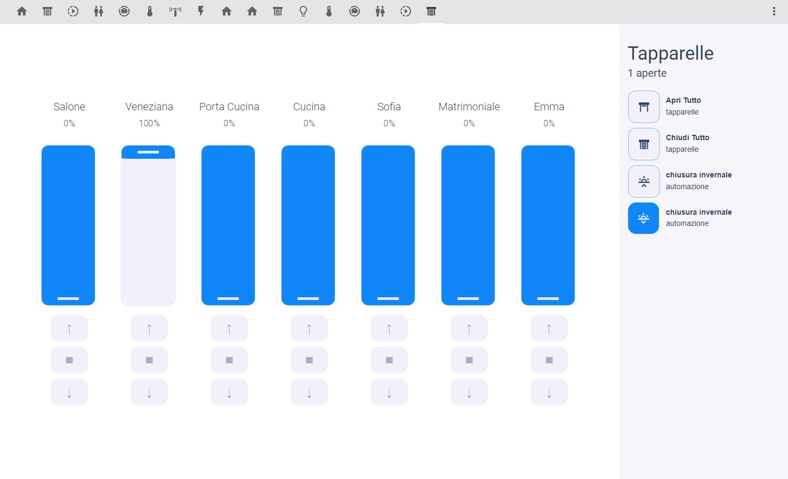

# NOTE: need in "your-theme.yaml"
```yaml
#button
  active-background-button-color: '#0080ff'
  deactive-background-button-color: "#f2f0fa"
  button-border-standard: rgba(0, 128, 255, .5)
  state-icon-active-color: "#0080ff"
```
# Shutter Cover Panel Card



# locelace config example

**panel: true** REQUIRED
 ```yaml
  - title: ''
    panel: true
    path: shutter
    icon: 'mdi:window-shutter'
    badges: []
    cards:
      - type: 'custom:shutter-cover-panel-card'
        title: Tapparelle
        innershadow: noenable
        iconemboss: noenable
        entities:
          - entity: cover.salone
            name: Salone
          - entity: cover.veneziana
          - entity: cover.porta_cucina
            name: Porta Cucina
          - entity: cover.cucina
            name: Cucina
          - entity: cover.sofia
            name: Sofia
          - entity: cover.camera_matrimoniale
            name: Matrimoniale
          - entity: cover.emma
            name: Emma
        sidebuttons:
          - entity: script.apri_tutto
            name: Apri Tutto
            label: tapparelle
            icon: 'mdi:window-shutter-open'
            cardtype: script
          - entity: script.chiudi_tutto
            name: Chiudi Tutto
            label: tapparelle
            icon: 'mdi:window-shutter'
            cardtype: script
          - entity: automation.chiusura_tapparella_alba
            name: chiusura invernale
            label: automazione
            icon: 'mdi:weather-sunset-up'
            cardtype: button
          - entity: automation.chiusura_tapparelle_invernale
            name: chiusura invernale
            label: automazione
            icon: 'mdi:weather-sunset-down'
            cardtype: button
```
## hack install

1. install `shutter-cover-panel-card.js` plugin

2. Add a reference to `shutter-cover-panel-card.js` inside your `ui-lovelace.yaml` or at the top of the *raw config editor UI*:

  ```yaml
  resources:
    - url: /community_plugin/shutter-cover-panel-card/shutter-cover-panel-card.js
      type: module
```

## Install

### Manual install

1. Download and copy `shutter-cover-panel-card.js` from (https://github.com/madmicio/shutter-cover-panel-card) into your `config/www`  directory.

2. Add a reference to `shutter-cover-panel-card.js` inside your `ui-lovelace.yaml` or at the top of the *raw config editor UI*:

  ```yaml
  resources:
    - url: /local/shutter-cover-panel-card.js
      type: module
  ```

### Main Options
| Name | Type | Default | Supported options | Description |
| -------------- | ----------- | ------------ | ------------------------------------------------ | --------------------------------------------------------------------------------------------------------------------------------------------------------------------------------------------------------------------------------------------------------------------------------------------------------------------------------------------- |
| `type` | string | **Required** | `custom:shutter-cover-panel-card` | Type of the card |
| `entities` | string | **Required** | entity | list of entitity |
| `innershadow` |  | enable | enable/disable | enable - disable innershadow in the card |
| `iconemboss` |  | enable | enable/disable | enable - disable icon emboss effect |
| `covercolor` |  | "#0080ff" | your color | define the cover color |
| `coverbackground` |  | "#f2f0fa" | your color | define the background cover color and up-stop-downbuttos background color |
| `background` |  | tranpsarent | your color | define the background card color |
| `coverWidth` |  | 100px |  | define the cover width |
| `coverheight` |  | 300px |  | define the cover height |
| `title` |  | string |  | card title  |
| `countText` |  | aperte |  | text after numer of open covers |
| `borderradius` |  | 15px |  | cover border-radius value |
| `buttonborderradius` |  | 15px |  | buttons border-radius value |

### entity Options
| Name | Type | Default | Supported options | Description |
| -------------- | ----------- | ------------ | ------------------------------------------------ | --------------------------------------------------------------------------------------------------------------------------------------------------------------------------------------------------------------------------------------------------------------------------------------------------------------------------------------------- |
| `entities` | string | **required** | entity | entity_id |
| `name` | string | optional | string | Define the name of the cover or automatically it takes the friendly name |

### side buttons Options
| Name | Type | Default | Supported options | Description |
| -------------- | ----------- | ------------ | ------------------------------------------------ | --------------------------------------------------------------------------------------------------------------------------------------------------------------------------------------------------------------------------------------------------------------------------------------------------------------------------------------------- |
| `entity` | string | **require** | entity  | entity_id |
| `name` | string | optional | string | Define the name of the button |
| `icon` | string | optional | `mdi:icon` | Icon to display. Will be overriden by the icon defined in a state |
| `type` | string | **Required** | script / button | define the card style and function. in script mode it doesn't change appearance, just click effect , in button mode the icon becomes a button to activate / deactivate the entity ||
